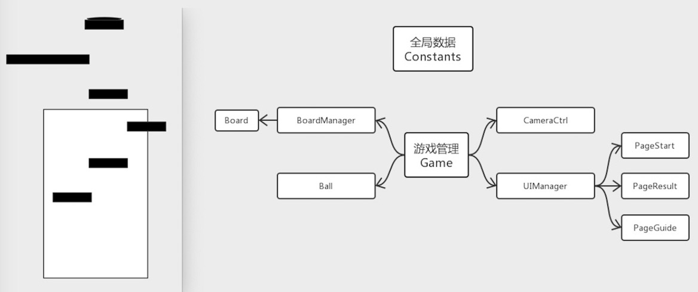
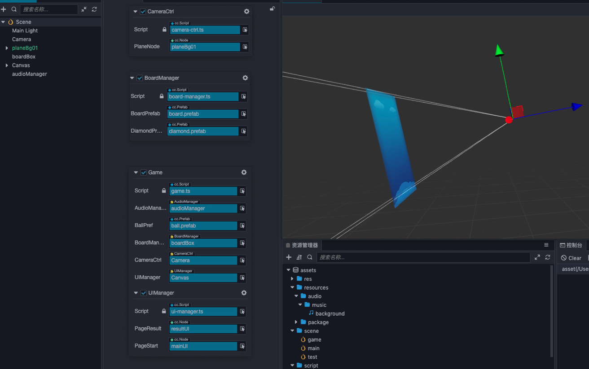
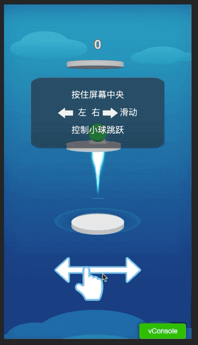

# 弹弹乐 3D 游戏教程

## 1. 游戏介绍

弹弹乐游戏是一款通过操作屏幕点击移动控制小球运动的休闲弹跳类游戏，在游戏过程中可以通过跳中板心或者板边分别获得 2 分和 1 分，以及吃钻石等方式获得分数。本文主要分享的是一个游戏的最基础的完整流程，并不具备一款游戏的发布能力。因此，在后续的拓展里就需要大家发挥创造力来将一款很简单的小游戏变成一款很有趣的小游戏。

## 2. 结构说明

以下是游戏的草图以及整体设计思路



在出完整体思路了之后，就可以开始设计一下每个阶段应该完成的目标，以便于提高代码编写的效率。以下是我划分的每个阶段的完成任务。
- 游戏初始化
  - 跳板初始化
  - 屏幕事件监听，小球与普通板块弹跳计算
  - 提供相机跟随接口
- 游戏核心逻辑编写
  - 跳板复用逻辑编写
  - 小球与不同板块弹跳计算
  - 游戏开始与结束逻辑编写
- 游戏丰富
  - 添加钻石以及吃砖石表现
  - 添加跳板表现
  - 增加小球粒子以及拖尾表现
  - 增加音效和音乐

初期设计完了后，我们开始整个游戏场景的搭建。整个游戏一共就一个场景，一个主程序 Game，负责管理所有分支管理的 Manager 以及负责事件的监听和派发；多个分支 Manager，负责管理跳板创建摆放或游戏页面等；一个全局配置模块，负责存储游戏中使用的配置；独立对象的运作脚本，负责自身行为运作。



## 3. 编写游戏内容逻辑

由于最终呈现出来的详细步骤代码太多，我这里就不一一演示，主要针对每个流程的几个关键部分做个说明。在这里有一个不会多做说明的部分就是 Constants 全局数据类，只需要记得游戏中的所有配置数据都存放在此即可。

### 游戏初始化

1. 跳板初始化

跳板初始化主要体现在 BoardManager 里的 ***initBoard*** 和 ***getNextPos*** 两个方法上。在整个游戏过程中，使用的板一共就只有 5 个，后续的跳板生成都是通过复用的方式，不断的去重新计算位置以及序号。跳板的生成也是严格根据上一个跳板的位置来计算，避免出现长距离位置偏移影响游戏进行。

```
getNextPos(board: Board, count: number, out ?: Vec3) {
    const pos: Vec3 = out ? out.set(board.node.position) : board.node.position.clone();
    const o = utils.getDiffCoeff(count, 1, 2);
    pos.x = (Math.random() - .5) * Constants.SCENE_MAX_OFFSET_X * o;
    if (board.type === Constants.BOARD_TYPE.SPRINT) {
        pos.y += Constants.BOARD_GAP_SPRINT;
        pos.x = board.node.position.x;
    }

    if (board.type === Constants.BOARD_TYPE.SPRING) {
        pos.y += Constants.BOARD_GAP_SPRING;
    } else {
        pos.y += Constants.BOARD_GAP;
    }
    return pos;
}

getDiffCoeff(e: number, t: number, a: number) {
    return (a * e + 1) / (1 * e + ((a + 1) / t - 1));
}
```

2. 屏幕事件监听，小球与普通板块弹跳计算

初始化完跳板之后，要开始做小球的弹跳。整个游戏的入口函数都设定在 Game 类上，Game 又添加在 Canvas 节点上，因此，Game 类所挂载的节点就作为全局对象的事件监听节点来使用最合适不过。因为主要接受该事件的对象是小球，所以，我们在小球里做监听的回调。

```
start () {
    Constants.game.node.on(Node.EventType.TOUCH_START, this.onTouchStart, this);
    Constants.game.node.on(Node.EventType.TOUCH_END, this.onTouchEnd, this);
    Constants.game.node.on(Node.EventType.TOUCH_MOVE, this.onTouchMove, this);

    this.updateBall();
    this.reset();
}

onTouchStart(touch: Touch, event: EventTouch){
    this.isTouch = true;
    this.touchPosX = touch.getLocation().x;
    this.movePosX = this.touchPosX;
}

onTouchMove(touch: Touch, event: EventTouch){
    this.movePosX = touch.getLocation().x;
}

onTouchEnd(touch: Touch, event: EventTouch){
    this.isTouch = false;
}
```

然后，小球根据一定比例的换算来做实际移动距离的计算。在 update 里每帧根据者冲刺等状态对小球进行 ***setPosX***，***setPosY*** 调整。小球的上升与下降是通过模拟重力效果来实现。

```
// Constants
static BALL_JUMP_STEP = [0.8, 0.6, 0.5, 0.4, 0.3, 0.2, 0.15, 0.1, 0.05, 0.03]; // 正常跳跃步长
static BALL_JUMP_FRAMES = 20; // 正常跳跃帧数

//Ball
_tempPos.set(this.node.position);
_tempPos.y += Constants.BALL_JUMP_STEP[Math.floor(this._currJumpFrame / 2)];
this.node.setPosition(_tempPos);
```

3. 提供相机跟随接口

相机的移动位置不是由自身来操控的，而是根据小球当前的位置来进行实时跟踪。因此，相机只需要调整好设置接口，按照一定脱离距离去跟随小球即可。

```
update() {
    _tempPos.set(this.node.position);
    if (_tempPos.x === this._originPos.x && _tempPos.y === this._originPos.y) {
        return;
    }

    // 横向位置误差纠正
    if (Math.abs(_tempPos.x - this._originPos.x) <= Constants.CAMERA_MOVE_MINI_ERR) {
        _tempPos.x = this._originPos.x;
        this.setPosition(_tempPos);
    } else {
        const x = this._originPos.x - _tempPos.x;
        _tempPos.x += x / Constants.CAMERA_MOVE_X_FRAMES;
        this.setPosition(_tempPos);
    }

    _tempPos.set(this.node.position);
    // 纵向位置误差纠正
    if (Math.abs(_tempPos.y - this._originPos.y) <= Constants.CAMERA_MOVE_MINI_ERR) {
        _tempPos.y = this._originPos.y;
        this.setPosition(_tempPos);
    } else {
        const y = this._originPos.y - _tempPos.y;
        if (this.preType === Constants.BOARD_TYPE.SPRING) {
            _tempPos.y += y / Constants.CAMERA_MOVE_Y_FRAMES_SPRING;
            this.setPosition(_tempPos);
        } else {
            _tempPos.y += y / Constants.CAMERA_MOVE_Y_FRAMES;
            this.setPosition(_tempPos);
        }
    }
}
```

### 游戏核心

整个游戏的节奏控制其实都是通过小球来的，小球通过弹跳位置决定什么时候开始新板的生成，小球在游戏过程中的得分决定了板子后续生成的丰富性（比如长板或者弹簧板），以及小球的死亡以及复活决定了游戏的状态等等。最后通过 UI 配合来完成游戏开始结束复活的界面引导交互操作。

1. 跳板复用逻辑编写

在前面创建跳板的时候我们说过，游戏中的跳板是不会累增的，都是通过复用来是实现，所以需要提前度量好板块间的最小距离。那么，屏幕最下方的板块在什么时机开始复用到屏幕最上方呢？举个例子：假设当前场景的板上限是 5 块，在数组里的顺序就是 0 - 4，按前面说的所有板在全显示的情况下是会均匀分布的，因此，屏幕的分割板就是在中间板的 2 号板，因此只要超过了 2，就代表小球已经跳过的屏幕的一半，这个时候就要开始清理无用的板了。

```
for (let i = this.currBoardIdx + 1; i >= 0; i--) {
    const board = boardList[i];

    // 超过当前跳板应该弹跳高度，开始下降
    if (this.jumpState === Constants.BALL_JUMP_STATE.FALLDOWN) {
        if (this.currJumpFrame > Constants.PLAYER_MAX_DOWN_FRAMES || this.currBoard.node.position.y - this.node.position.y > Constants.BOARD_GAP + Constants.BOARD_HEIGTH) {
            Constants.game.gameDie();
            return;
        }

        // 是否在当前检测的板上
        if (this.isOnBoard(board)) {
            this.currBoard = board;
            this.currBoardIdx = i;
            this.activeCurrBoard();
            break;
        }
    }
}

// 当超过中间板就开始做板复用
for (let l = this.currBoardIdx - Constants.BOARD_NEW_INDEX; l > 0; l--) {
    this.newBoard();
}
```

2. 小球与不同板块弹跳计算

从上面的制作过程中我们已经实现来在普通板上小球是一个乒乓球状态，那么遇到弹簧板或者冲刺板的时候，也可以用类似逻辑结构来继续补充不同板子的不同处理。这里的实现因为结构已定较为简单，就不再多做说明，只需要在全局数据类里加上相应的相同配置即可。

3. 游戏开始与结束逻辑编写

游戏开始以及结束都是通过 UI 界面来实现。定义一个 UIManager 管理类来管理当前 UI 界面。所有的 UI 打开与关闭都通过此管理类来统一管理，点击事件的响应都直接回调给游戏主循环 Game 类。

以上部分就基本完成了整个游戏的逻辑部分。

### 游戏丰富

即使上面的游戏结束了也会觉得整体的表现显得有些单薄。因此，接下来丰富一下游戏的真实表现力。

1. 添加钻石以及吃砖石表现

因为游戏内的跳板数量限制，因此，我们可以大方的给每个跳板配置 5 个钻石，通过随机概率决定钻石的显示

```
if (this.type === Constants.BOARD_TYPE.GIANT) {
    for (let i = 0; i < 5; i++) {
        this.diamondList[i].active = true;
        this.hasDiamond = true;
    }
} else if (this.type === Constants.BOARD_TYPE.NORMAL || this.type === Constants.BOARD_TYPE.DROP) {
    if (Math.random() > .7) {
        this.diamondList[2].active = true;
        this.hasDiamond = true;
    }
}
```

既然有了钻石，那吃钻石的时候，肯定也要有些表示。那就是掉落一些粒子来增加表现。由于游戏设计过程中如果有很多对频繁的创建和销毁的话，对性能其实是很不友好的。因此，提供一个对象池在一款游戏中是必不可少。在这里，我们就可以把散落的粒子存放在对象池里进行复用。在这款游戏的设计过程中，小球部分的计算量是很频繁的，特别是在每帧需要更新的地方，想要去做性能优化的同学可以根据对象池的概念对小球里的一些向量进行复用。

```
getNode(prefab: Prefab, parent: Node) {
    let name = prefab.data.name;
    this.dictPrefab[name] = prefab;
    let node: Node = null;
    if (this.dictPool.hasOwnProperty(name)) {
        //已有对应的对象池
        let pool = this.dictPool[name];
        if (pool.size() > 0) {
            node = pool.get();
        } else {
            node = instantiate(prefab);
        }
    } else {
        //没有对应对象池，创建他！
        let pool = new NodePool();
        this.dictPool[name] = pool;

        node = instantiate(prefab);
    }

    node.parent = parent;
    return node;
}

putNode(node: Node) {
    let name = node.name;
    let pool = null;
    if (this.dictPool.hasOwnProperty(name)) {
        //已有对应的对象池
        pool = this.dictPool[name];
    } else {
        //没有对应对象池，创建他！
        pool = new cc.NodePool();
        this.dictPool[name] = pool;
    }

    pool.put(node);
}
```

2. 添加跳板表现和增加小球粒子以及拖尾表现

其实这两点功能都基本类似，都是增加一些波动，拖尾粒子等来丰富表现，在这里就不过多说明，具体的表现都写在了 Board 类和 Ball 类相对应关键字的方法里。

3. 增加音效和音乐

因为是基础教程，游戏内的表现也不是很多，所以就选取了按钮被点击的音效和背景音乐来做效果。

```
playSound(play = true) {
    if (!play) {
        this.audioComp.stop();
        return;
    }

    this.audioComp.clip = this.bg;
    this.audioComp.play();
}

playClip() {
    this.audioComp.playOneShot(this.click);
}
```

以上就是本教程的全部内容。接下来看一下运行结果吧。


